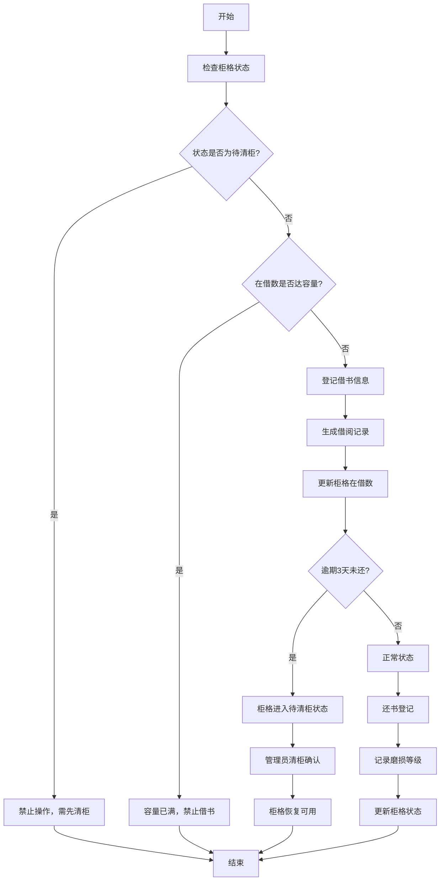

## 1. 产品概述

社区旧书漂流柜流转登记系统，用于管理社区共享书柜的借阅流转。解决社区旧书漂流过程中缺乏有效追踪、逾期管理混乱、柜格状态不透明的问题，提升图书资源的流转效率与社区服务品质。

## 2. 核心功能

### 2.1 用户角色

| 角色 | 注册方式 | 核心权限 |
|------|----------|----------|
| 社区管理员 | 系统内置账号 | 柜格管理、借阅登记、还书登记、清柜操作、查看逾期列表 |
| 社区居民 | 无需注册 | 仅通过管理员登记借还书 |

### 2.2 功能模块

1. **柜格总览页**：柜格状态可视化（在借/空位/待清柜）、容量统计、快速操作入口
2. **单格详情页**：借阅时间线、历史记录、当前借阅状态
3. **待清柜管理页**：待清柜列表、清柜确认操作、逾期原因记录
4. **逾期提醒页**：逾期图书列表、逾期天数统计、居民信息展示
5. **借还登记弹窗**：取书登记（取走时间、预计归还日）、还书登记（实际归还日、书脊磨损等级）

### 2.3 页面详情

| 页面名称 | 模块名称 | 功能描述 |
|----------|----------|----------|
| 柜格总览页 | 状态统计卡片 | 展示总柜格数、在借数、空位数、待清柜数 |
| 柜格总览页 | 柜格网格 | 彩色编码展示每个柜格的状态，点击进入详情 |
| 柜格总览页 | 快速操作区 | 借书登记、还书登记快捷按钮 |
| 单格详情页 | 基本信息区 | 柜格编号、容量上限、当前在借数、状态 |
| 单格详情页 | 借阅时间线 | 按时间倒序展示该柜格所有借阅记录 |
| 单格详情页 | 操作按钮 | 根据当前状态展示可用操作（借书/还书/清柜） |
| 待清柜管理页 | 待办列表 | 展示所有待清柜的柜格，包含逾期信息 |
| 待清柜管理页 | 清柜确认 | 点击确认清柜，柜格恢复可用状态 |
| 逾期提醒页 | 逾期列表 | 展示所有逾期图书，按逾期天数排序 |
| 借书登记弹窗 | 表单 | 选择柜格、输入取走时间、预计归还日、居民姓名 |
| 还书登记弹窗 | 表单 | 选择借阅记录、输入实际归还日、选择书脊磨损等级 |

## 3. 核心流程

### 3.1 借书流程

1. 管理员检查柜格状态（非待清柜且未达容量上限）
2. 登记居民姓名、取走时间、预计归还日
3. 系统更新柜格在借数，生成借阅记录
4. 柜格状态自动判断：若在借数达容量上限，标记为"已满"

### 3.2 还书流程

1. 管理员查询借阅记录
2. 登记实际归还日、选择书脊磨损等级（1-5）
3. 系统更新借阅记录，柜格在借数-1
4. 柜格状态自动判断：若在借数为0，标记为"空位"

### 3.3 待清柜流程

1. 系统每日巡检：某册逾期3天仍未还
2. 柜格自动进入"待清柜"状态
3. 待清柜期间：禁止新借书登记，允许还书
4. 管理员处理待清柜：确认清柜操作
5. 柜格恢复可用状态

## 4. 用户界面设计

### 4.1 设计风格

- **主色调**：森林绿（#2D5A27）- 象征环保、社区、生命力
- **辅助色**：暖橙色（#E07B39）- 用于提醒、逾期状态
- **中性色**：米白色背景（#FAF7F2）、深灰文字（#2C2C2C）
- **按钮风格**：圆角矩形，微阴影，悬停时轻微上浮
- **字体**：标题用「思源宋体」体现书卷气，正文用「思源黑体」保证可读性
- **布局风格**：卡片式布局，温暖纸质质感，细腻阴影层次
- **装饰元素**：书脊纹理背景、纸张质感分割线

### 4.2 页面设计概述

| 页面名称 | 模块名称 | UI 元素 |
|----------|----------|----------|
| 柜格总览页 | 状态统计卡片 | 四种颜色卡片（绿/蓝/灰/橙），数字放大，图标装饰 |
| 柜格总览页 | 柜格网格 | 4列网格，每个柜格是带圆角的色块，hover有放大动效 |
| 单格详情页 | 借阅时间线 | 左侧垂直时间轴，右侧卡片记录，连点成线 |
| 待清柜管理页 | 待办列表 | 卡片列表，左侧橙色状态标记，右侧操作按钮 |
| 逾期提醒页 | 逾期列表 | 表格形式，逾期天数列红色高亮 |
| 借还登记弹窗 | 表单 | 半透明毛玻璃背景，表单元素间距宽松 |

### 4.3 响应式设计

- 桌面端优先（1280px 及以上）：4列柜格网格，侧边导航
- 平板端（768px - 1279px）：3列柜格网格，顶部导航
- 移动端（768px 以下）：2列柜格网格，底部导航
- 所有交互元素保证最小 44px 触摸区域

## 5. 业务规则

### 5.1 容量限制规则

- 每个柜格有固定容量上限（1-10册可配置）
- 当前在借册数 = 容量上限时，禁止新的借书登记
- 在借册数随还书操作递减

### 5.2 待清柜规则

- 触发条件：任一一册图书逾期超过3天未还
- 柜格状态变更为「待清柜」
- 待清柜期间：禁止新借书登记，但仍接受还书
- 清柜操作：管理员确认后柜格恢复正常
- 强行还书处理：待清柜期间仍可正常还书，系统记录但不自动解除待清柜状态，需管理员手动清柜确认

### 5.3 书脊磨损等级

- 等级 1：崭新，无磨损
- 等级 2：轻微磨损，书脊完整
- 等级 3：中度磨损，有折痕但不影响阅读
- 等级 4：严重磨损，书脊有开裂
- 等级 5：损坏严重，需下架维修
