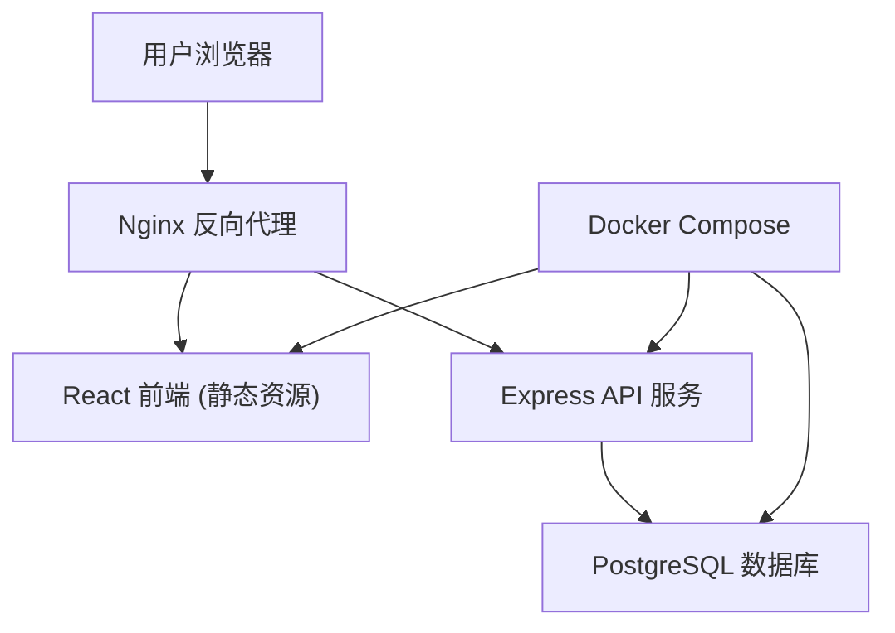
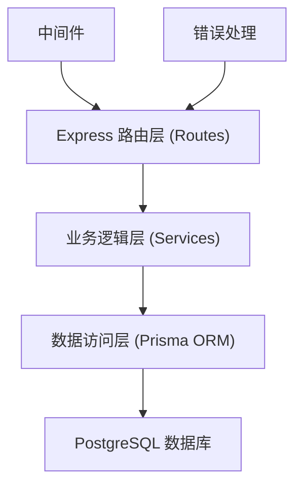
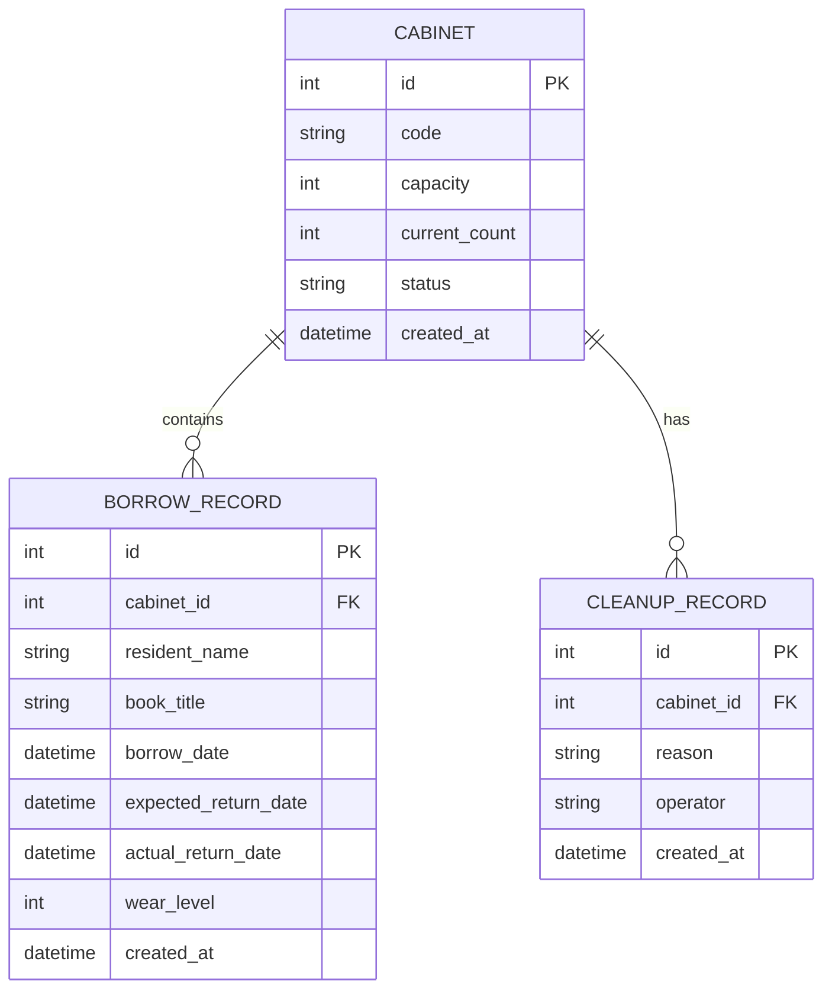

## 1. 架构设计



## 2. 技术描述

- **前端**：React@18 + TypeScript + Vite + React Router@6 + Axios
- **样式方案**：TailwindCSS@3 + CSS 变量主题系统
- **后端**：Node.js@20 + Express@4 + TypeScript
- **ORM**：Prisma@5（类型安全的数据库访问）
- **数据库**：PostgreSQL@15
- **容器化**：Docker + Docker Compose
- **初始化方式**：分别使用 Vite 初始化前端，npm init 初始化后端

## 3. 路由定义

| 路由 | 用途 |
|------|------|
| / | 柜格总览页 |
| /cabinet/:id | 单格详情页 |
| /cleanup | 待清柜管理页 |
| /overdue | 逾期提醒页 |

## 4. API 定义

### 4.1 TypeScript 类型定义

```typescript
// 柜格状态
type CabinetStatus = 'available' | 'partial' | 'full' | 'pending_cleanup';

// 书脊磨损等级
type WearLevel = 1 | 2 | 3 | 4 | 5;

// 柜格
interface Cabinet {
  id: number;
  code: string;           // 柜格编号
  capacity: number;       // 容量上限
  currentCount: number;   // 当前在借册数
  status: CabinetStatus;
  createdAt: Date;
}

// 借阅记录
interface BorrowRecord {
  id: number;
  cabinetId: number;
  residentName: string;   // 居民姓名
  bookTitle: string;      // 书名
  borrowDate: Date;       // 取走时间
  expectedReturnDate: Date; // 预计归还日
  actualReturnDate: Date | null; // 实际归还日
  wearLevel: WearLevel | null;   // 书脊磨损等级
  isOverdue: boolean;     // 是否逾期
  overdueDays: number;    // 逾期天数
  createdAt: Date;
}

// 清柜记录
interface CleanupRecord {
  id: number;
  cabinetId: number;
  reason: string;         // 清柜原因
  operator: string;       // 操作员
  createdAt: Date;
}
```

### 4.2 REST API 接口

| 方法 | 路径 | 描述 | 请求体 | 响应 |
|------|------|------|--------|------|
| GET | /api/cabinets | 获取所有柜格列表 | - | Cabinet[] |
| GET | /api/cabinets/:id | 获取单个柜格详情 | - | Cabinet & { records: BorrowRecord[] } |
| GET | /api/cabinets/:id/records | 获取柜格借阅记录 | - | BorrowRecord[] |
| POST | /api/borrow | 借书登记 | { cabinetId, residentName, bookTitle, borrowDate, expectedReturnDate } | BorrowRecord |
| POST | /api/return/:id | 还书登记 | { actualReturnDate, wearLevel } | BorrowRecord |
| POST | /api/cleanup/:id | 确认清柜 | { reason, operator } | Cabinet |
| GET | /api/overdue | 获取逾期借阅列表 | - | BorrowRecord[] |
| GET | /api/pending-cleanup | 获取待清柜列表 | - | Cabinet[] |
| GET | /api/stats | 获取统计数据 | - | { total, available, borrowed, pendingCleanup } |

## 5. 服务端架构



**目录结构**：
```
backend/
├── src/
│   ├── routes/          # 路由定义
│   ├── services/        # 业务逻辑
│   ├── middleware/      # 中间件
│   ├── utils/           # 工具函数
│   ├── prisma/          # Prisma schema & migrations
│   ├── index.ts         # 应用入口
│   └── types.ts         # 类型定义
├── Dockerfile
└── package.json
```

## 6. 数据模型

### 6.1 ER 图



### 6.2 DDL 语句

```sql
-- 创建枚举类型
CREATE TYPE cabinet_status AS ENUM ('available', 'partial', 'full', 'pending_cleanup');

-- 柜格表
CREATE TABLE cabinets (
    id SERIAL PRIMARY KEY,
    code VARCHAR(20) UNIQUE NOT NULL,
    capacity INTEGER NOT NULL DEFAULT 5,
    current_count INTEGER NOT NULL DEFAULT 0,
    status cabinet_status NOT NULL DEFAULT 'available',
    created_at TIMESTAMP NOT NULL DEFAULT CURRENT_TIMESTAMP
);

-- 借阅记录表
CREATE TABLE borrow_records (
    id SERIAL PRIMARY KEY,
    cabinet_id INTEGER NOT NULL REFERENCES cabinets(id),
    resident_name VARCHAR(100) NOT NULL,
    book_title VARCHAR(200) NOT NULL,
    borrow_date TIMESTAMP NOT NULL,
    expected_return_date TIMESTAMP NOT NULL,
    actual_return_date TIMESTAMP,
    wear_level INTEGER CHECK (wear_level BETWEEN 1 AND 5),
    created_at TIMESTAMP NOT NULL DEFAULT CURRENT_TIMESTAMP
);

-- 清柜记录表
CREATE TABLE cleanup_records (
    id SERIAL PRIMARY KEY,
    cabinet_id INTEGER NOT NULL REFERENCES cabinets(id),
    reason TEXT NOT NULL,
    operator VARCHAR(100) NOT NULL,
    created_at TIMESTAMP NOT NULL DEFAULT CURRENT_TIMESTAMP
);

-- 索引
CREATE INDEX idx_borrow_records_cabinet_id ON borrow_records(cabinet_id);
CREATE INDEX idx_borrow_records_returned ON borrow_records(actual_return_date);
CREATE INDEX idx_cleanup_records_cabinet_id ON cleanup_records(cabinet_id);
```

### 6.3 初始演示数据

```sql
-- 插入12个柜格
INSERT INTO cabinets (code, capacity, current_count, status) VALUES
('A01', 5, 2, 'partial'),
('A02', 5, 0, 'available'),
('A03', 5, 5, 'full'),
('A04', 5, 1, 'partial'),
('B01', 5, 3, 'partial'),
('B02', 5, 0, 'available'),
('B03', 5, 2, 'partial'),
('B04', 5, 4, 'partial'),
('C01', 5, 0, 'available'),
('C02', 5, 1, 'pending_cleanup'),
('C03', 5, 2, 'partial'),
('C04', 5, 0, 'available');

-- 插入借阅记录
INSERT INTO borrow_records (cabinet_id, resident_name, book_title, borrow_date, expected_return_date, actual_return_date, wear_level) VALUES
-- A01 在借
(1, '张三', '活着', CURRENT_TIMESTAMP - INTERVAL '2 days', CURRENT_TIMESTAMP + INTERVAL '12 days', NULL, NULL),
(1, '李四', '平凡的世界', CURRENT_TIMESTAMP - INTERVAL '1 day', CURRENT_TIMESTAMP + INTERVAL '13 days', NULL, NULL),
-- A01 已还
(1, '王五', '三体', CURRENT_TIMESTAMP - INTERVAL '20 days', CURRENT_TIMESTAMP - INTERVAL '6 days', CURRENT_TIMESTAMP - INTERVAL '7 days', 2),
-- A03 全满
(3, '赵六', '百年孤独', CURRENT_TIMESTAMP - INTERVAL '5 days', CURRENT_TIMESTAMP + INTERVAL '9 days', NULL, NULL),
(3, '孙七', '红楼梦', CURRENT_TIMESTAMP - INTERVAL '4 days', CURRENT_TIMESTAMP + INTERVAL '10 days', NULL, NULL),
(3, '周八', '西游记', CURRENT_TIMESTAMP - INTERVAL '3 days', CURRENT_TIMESTAMP + INTERVAL '11 days', NULL, NULL),
(3, '吴九', '水浒传', CURRENT_TIMESTAMP - INTERVAL '2 days', CURRENT_TIMESTAMP + INTERVAL '12 days', NULL, NULL),
(3, '郑十', '三国演义', CURRENT_TIMESTAMP - INTERVAL '1 day', CURRENT_TIMESTAMP + INTERVAL '13 days', NULL, NULL),
-- C02 待清柜（逾期5天）
(10, '陈一', '追风筝的人', CURRENT_TIMESTAMP - INTERVAL '18 days', CURRENT_TIMESTAMP - INTERVAL '5 days', NULL, NULL),
-- B04 其中一册逾期4天（触发待清柜边缘）
(8, '刘二', '小王子', CURRENT_TIMESTAMP - INTERVAL '17 days', CURRENT_TIMESTAMP - INTERVAL '3 days', NULL, NULL),
(8, '杨三', '围城', CURRENT_TIMESTAMP - INTERVAL '1 day', CURRENT_TIMESTAMP + INTERVAL '13 days', NULL, NULL),
(8, '黄四', '边城', CURRENT_TIMESTAMP - INTERVAL '2 days', CURRENT_TIMESTAMP + INTERVAL '12 days', NULL, NULL),
(8, '朱五', '骆驼祥子', CURRENT_TIMESTAMP - INTERVAL '3 days', CURRENT_TIMESTAMP + INTERVAL '11 days', NULL, NULL);
```
